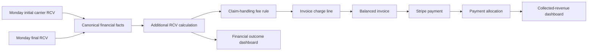
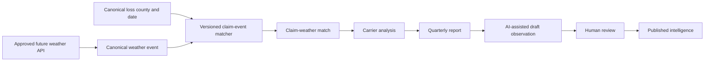
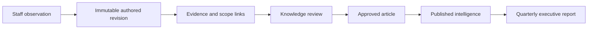

# Data Lineage Examples

These examples are synthetic and illustrate the lineage contract. Every arrow represents a persisted provenance link, a versioned transformation, or an audited human action.

## Example 1 — Completed file to completion-to-cash reporting

Synthetic facts:

- Archive `2026 Q1` row reports file `TS-1042`, submitted January 12 and completed March 20.
- The import job hashes the artifact, stores the raw row, maps the service type, and appends the completion status event.
- `completion_quarter` derives as `2026 Q1`; the archive quarter remains a separate source fact.
- Invoice `INV-1042` is issued April 2 for $900, producing invoice quarter `2026 Q2`.
- Stripe payment `pi_demo_1042` settles June 20. Exact invoice metadata wins and creates a $900 allocation.
- Collection quarter is `2026 Q2`; completion-to-cash lag is 92 days.

Trust envelope:

- Completion: measured from archived status event, confidence B if full event history is incomplete.
- Completion quarter: derived, calculation version `calendar-quarter-v1`.
- Cash: measured from Stripe, confidence A after full allocation and reconciliation.
- Cohort bridge: derived, confidence B or A according to chain coverage.

Failure path: if invoice metadata is absent and two $900 invoices fit the customer/date window, reconciliation becomes `ambiguous`; cash remains measured but completion-to-cash attribution is unavailable until review.

## Example 2 — RCV change through invoice and cash

Synthetic values:

- Initial carrier RCV: $25,000; final RCV: $41,500.
- Both values are captured, USD, and validation-valid.
- `additional_rcv = 41,500 − 25,000 = 16,500`.
- A versioned fee rule produces a $1,237.50 claim-handling charge for illustration; the rule result is not a source fact.
- Invoice total equals its charge lines.
- Stripe payment allocation is capped by both available payment and open invoice balance.

Trust:

- Initial/final RCV: measured, each with source lineage and field-level status.
- Additional RCV: derived; unavailable if either operand is null, invalid, or currency-incompatible.
- Claim-handling fee: derived or measured depending on whether the operational system records the approved line; the metric must declare which.
- Collected revenue: derived from measured Stripe cash plus an approved allocation.

Conflict: if Monday supplies $16,000 as “additional RCV,” the canonical calculation remains $16,500. Both values are retained, validation opens an issue, and no latest-wins update occurs.

## Example 3 — Weather evidence to reviewed intelligence

The weather provider owns event facts. County and loss date come from canonical claim facts with geocoding provenance. The match is derived and contains algorithm version, evidence, confidence, and evaluation time. It indicates review opportunity, not causation.

An AI-assisted observation, if later approved, is an estimated draft and cannot publish automatically. It must cite the match and supporting metrics, remain tenant-scoped, and pass human review. The approved article records author/reviewer and publication state.

Failure path: missing county lowers coverage; a match is unavailable for that file rather than assumed false. Provider disagreement retains both source events until the approved provider-resolution policy applies.

## Example 4 — Staff observation to quarterly executive report

A TotalScope staff member records a recurring-denial observation scoped to one carrier, two states, and Q1 2026. The statement is labeled human observation, not measured fact. Evidence links include canonical file cohorts and a versioned denial-rate metric.

Content Editor revises the draft; Content Publisher approves it. Publication preserves all revisions and the approval audit trail. If the underlying metric later changes, the article is not silently rewritten: it is reviewed, superseded, or retired.

Trust:

- Statement: estimated/human observation with declared confidence.
- Supporting denial rate: derived with coverage and calculation version.
- Publication: validation status includes evidence completeness and reviewer approval.

## Trace query expectations

A future lineage service must answer in both directions:

1. Given a dashboard number, return metric version, source entities, source records, import jobs, validation outcomes, exclusions, and coverage.
2. Given a source row, return every canonical field, derived metric, reconciliation, and publication that depends on it.
3. Given a manual correction, return original facts, override reason, actor, effective time, and downstream recalculation version.
4. Given a source conflict, show all candidates, winning authority rule, reviewer decision, and unresolved impact.
