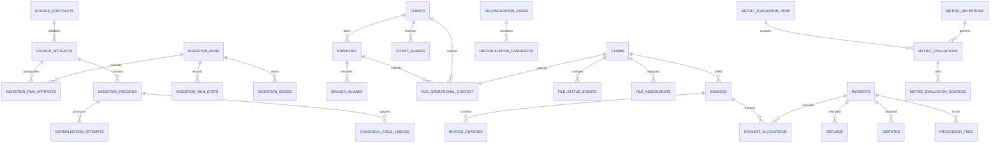
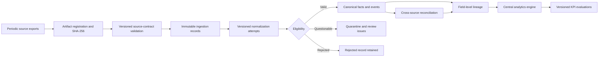
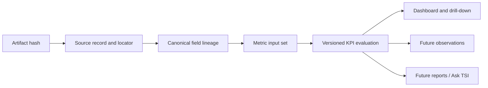
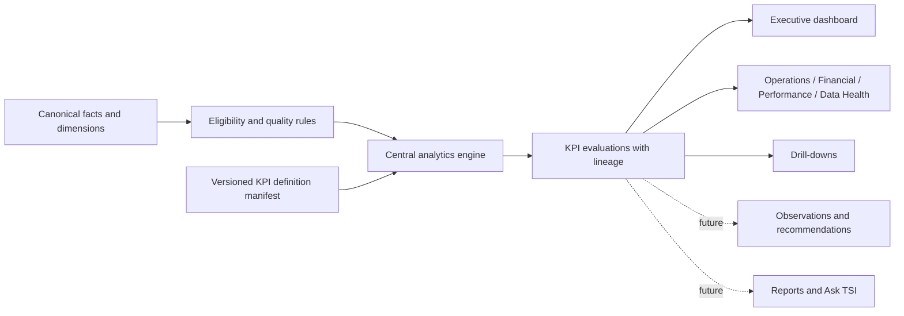
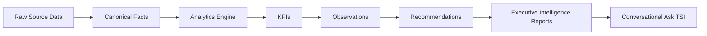

# TotalScope Intelligence C3 Architecture Freeze

Status: **Proposed for approval**
Milestone: **C3 - Executive Operations MVP**
Environment: **Internal, single-workspace staging**
Business timezone: **America/New_York**
Currency scope: **USD only**

> TotalScope Intelligence exists to convert operational data into actionable business intelligence. Data storage, reporting, and dashboards exist only to support that mission.

> Every summarized conclusion must be traceable to its source.

> TotalScope Intelligence should never require a user to manually calculate, compare, reconcile, or interpret operational data that the system can derive itself. Every feature should reduce cognitive effort while increasing confidence in the underlying data.

This document freezes the intended C3 product and technical architecture. It does not authorize implementation, hosted migration, data import, deployment, or production work.

## 1. Revised Scope and Non-Goals

### C3 scope

C3 delivers one complete internal operational-intelligence workflow:

1. Controlled periodic ingestion of:
   - Monday or comprehensive TotalScope historical file exports;
   - Stripe periodic transaction exports;
   - client and branch master data; and
   - claim-handler assignments.
2. Versioned source contracts supporting historical full imports and later incremental imports.
3. Additive normalization into the existing TotalScope Intelligence data model.
4. Immutable source provenance, validation, deduplication, import history, quarantine, and visible error handling.
5. One centralized, versioned analytics engine used by every C3 presentation surface.
6. Protected executive, operational, financial, performance, and Data Health intelligence.
7. Drill-downs for clients, branches, handlers, files, imports, and payment exceptions.
8. Deterministic synthetic fixtures and automated validation.

C3 is an internal, single-workspace staging MVP. Imports, reconciliation tools, and payment-exception detail are restricted to `staging_admin`. Authenticated viewers may access approved operational intelligence, file drill-downs, and constrained financial results.

### Non-goals

C3 does not include:

- client-facing tenant authorization;
- production deployment or production credentials;
- a live Monday or Stripe API integration;
- automatic imports during deployment;
- photos or image-file ingestion;
- the final PDF Executive Intelligence Report;
- automated observations or recommendations;
- chat-with-the-data or Ask TSI;
- a user-editable formula builder;
- cross-currency aggregation;
- predicted client charges;
- custom domains or DNS;
- every future integration or source-specific mapping;
- silent lifecycle-date inference; or
- replacement or weakening of the validated C1 Q2 importer.

## 2. Final Terminology and Proposed Route Map

### Final recommendation

Use **Executive Operations Dashboard** as the primary user-experience description and `/operations` as its day-neutral route root. The product name remains **TotalScope Intelligence**.

Rationale:

- “Monday Intelligence” incorrectly ties the architecture to a weekday and one source.
- `/operations` directly describes the executive job to be done without inventing a second product name.
- The existing `/operations` placeholder can evolve into the C3 route root without creating a competing navigation concept.
- Financial, Performance, and Data Health remain peer executive-operation domains beneath the same route.

“Monday Review” remains an optional saved preset that selects the current weekly operating window. It is not a separate calculation path.

### Route map

| Route | Purpose | Minimum role |
|---|---|---|
| `/operations` | Executive operations overview | active authenticated viewer |
| `/operations/workflow` | Inventory, throughput, aging, readiness, attention | active authenticated viewer |
| `/operations/financial` | Settlement gain, invoiced charges, cash, refunds, coverage | active authenticated viewer, constrained results |
| `/operations/performance` | Client, branch, handler, and carrier dimensions | active authenticated viewer |
| `/operations/data-health` | Freshness, imports, coverage, lineage, reconciliation health | active authenticated viewer, sanitized |
| `/operations/clients` | Client list and comparison | active authenticated viewer |
| `/operations/clients/[id]` | Approved client operational and financial summary | active authenticated viewer |
| `/operations/branches` | Branch list and comparison | active authenticated viewer |
| `/operations/branches/[id]` | Approved branch summary | active authenticated viewer |
| `/operations/handlers` | Handler workload and performance | active authenticated viewer |
| `/operations/handlers/[id]` | Handler drill-down | active authenticated viewer |
| `/operations/files` | Canonical file explorer | active authenticated viewer |
| `/operations/files/[id]` | File facts, calculations, events, and lineage | active authenticated viewer |
| `/operations/imports` | Import history and operational controls | `staging_admin` |
| `/operations/imports/[id]` | Run steps, counts, issues, and provenance | `staging_admin` |
| `/operations/payment-exceptions` | Failed payments and reconciliation exceptions | `staging_admin` |
| `/operations/payment-exceptions/[id]` | Restricted exception evidence and workflow | `staging_admin` |

The existing `/dashboard`, `/claims`, and `/admin/imports/q2-2026` routes remain available during migration. Redirects or retirement require a later explicit decision after C3 acceptance.

## 3. Current-State Architecture Summary

### Proven foundation

- Next.js 15 App Router, TypeScript, Tailwind, responsive shared dashboard shell.
- Supabase email/password Auth with cookie-backed server sessions.
- `viewer` and `staging_admin` application roles.
- Defense-in-depth middleware, route layouts, column grants, and RLS.
- Browser reads use the anon key and authenticated user JWT.
- Service-role access is restricted to explicit importer operations.
- Three hosted migrations match local history without drift.
- C1 provides immutable Monday workbook provenance, staging records, canonical claims, financial facts, derived metrics, updates, review issues, deterministic hashing, bounded batches, retry safety, and count-gated finalization.
- C2 provides protected staging routes, coarse health, and a constrained administrator validation RPC.

### Current limitations C3 must address

- The importer and validation contract are fixed to one Q2 2026 workbook.
- There is no generalized import-attempt or multi-artifact source ledger.
- The actual schema has no client, branch, invoice, charge, payment, refund, payment-failure, dispute, processor-fee, allocation, or reconciliation entities.
- Current organizations are limited to contractors and carriers.
- Current `claims.service_type` and `property_type` are intentionally null.
- Handler associations lack effective-dated assignment history.
- Ambiguous Monday lifecycle dates are retained but not authoritative.
- Live calculations are embedded in `lib/data/live-repository.ts`; demo calculations exist separately.
- Operations, carrier, contractor, weather, and reports pages still use demo calculations.
- Live filters and KPI metadata are not centralized.
- Current PostgREST query strings are suitable for the validated slice, not a growing analytical workload.
- Data Health is represented primarily by one import-validation page.
- The global environment validator is not invoked at one application-wide boundary.

### Hosted staging baseline

- Supabase project: `totalscope-intelligence-staging`.
- Region: `us-east-1`.
- Applied migrations: 3.
- Vercel project: `totalscope-intelligence-staging`.
- Stable deployment status: Ready.
- Stable deployment branch: `feature/c2-staging-foundation`.
- Existing health result: application, configuration, and database `ok`.
- No service-role variable is present in Vercel.

## 4. Proposed Additive Schema

All changes are introduced through new forward migrations. Existing C1 migration files, tables, keys, and importer behavior remain unchanged.

### 4.1 Generalized ingestion

| Entity | Important fields | Keys and indexes |
|---|---|---|
| `source_contracts` | source system, dataset type, contract version, schema hash, effective dates, approval state, manifest | unique `(source_system, dataset_type, contract_version)`; approval/effective index |
| `source_artifacts` | source system, artifact type, filename, SHA-256, covered period, size, received time, protected storage pointer, contract | unique `(source_system, sha256)`; covered-period and contract indexes |
| `ingestion_runs` | mode (`full`/`incremental`), artifact set fingerprint, parser/mapping versions, status, actor, counts, timestamps | unique deterministic run key; status/start indexes |
| `ingestion_run_artifacts` | run, artifact, logical table, sequence | unique `(run_id, artifact_id)` |
| `ingestion_run_steps` | step name, batch sequence, status, input/output counts, sanitized error, retry number, timing | unique `(run_id, step_name, batch_sequence, retry_number)`; status index |
| `ingestion_records` | artifact, logical table, source locator, stable source key, raw/protected payload, row hash, observed time | unique `(artifact_id, logical_table, source_locator)`; source-key and hash indexes |
| `normalization_attempts` | record, mapping version, normalized payload, outcome, warnings, errors, attempted time | unique `(ingestion_record_id, mapping_version, attempt_number)` |
| `ingestion_issues` | deterministic scoped key, run/record, category, severity, state, evidence, resolution | unique `(run_id, deterministic_key)`; queue indexes |

`ingestion_records` supports multiple related source tables. It does not require a flattened spreadsheet.

### 4.2 Operational master and file context

| Entity | Relationships and purpose | Keys and indexes |
|---|---|---|
| `clients` | canonical client master | unique stable internal key; normalized-name index |
| `client_aliases` | client source identifiers and names | unique `(source_system, external_id)`; normalized-alias index |
| `branches` | belongs to one client | unique `(client_id, stable_branch_key)`; client/status indexes |
| `branch_aliases` | source-specific branch keys and names | unique `(source_system, external_id)` |
| `file_operational_context` | one-to-one extension of existing `claims`; stable TotalScope file ID, client, branch, service type, authoritative dates and availability | unique `claim_id`; unique stable TotalScope file ID; client/branch/service/status indexes |
| `file_status_events` | append-only status history | unique source-event key; `(claim_id, effective_at desc)`; one current projection constraint |
| `file_assignments` | effective-dated handler/estimator/other assignment | `(claim_id, assignment_type, started_at)`; one current assignment per type |
| `file_documents` | non-photo document metadata or protected pointer only | source document key; claim/type/date indexes |
| `file_tags` | versioned normalized tags with source linkage | unique source tag key |
| `file_custom_field_facts` | source key, raw value, normalized value, availability, mapping version | claim/field/effective indexes |

`file_operational_context` avoids changing the validated C1 claim contract during the first C3 migration. A later approved consolidation may promote its fields into the main claim model.

### 4.3 Financial events and reconciliation

| Entity | Purpose | Keys and indexes |
|---|---|---|
| `invoices` | canonical invoice header, file/client/branch relationship, dates, status, USD totals | unique internal invoice ID and source invoice ID; file/client/date/status indexes |
| `invoice_charges` | immutable typed charge facts and void/reversal state | invoice/type/date indexes |
| `payments` | successful or pending processor payments; Stripe IDs and settlement facts | unique processor payment/charge IDs; settlement/date/status indexes |
| `payment_failures` | first-class failed attempts with sanitized failure classification | unique processor event/attempt ID; client/date/reason indexes |
| `refunds` | first-class refund events linked to payment | unique processor refund ID; payment/date/status indexes |
| `disputes` | first-class dispute events and state history | unique processor dispute ID; payment/status/date indexes |
| `processor_fees` | first-class processor fee events | unique processor balance-transaction ID; payment/date indexes |
| `payment_allocations` | payment-to-invoice allocation facts | unique allocation key; payment and invoice indexes; amount invariant |
| `reconciliation_cases` | unresolved or completed matching workflow | state/severity/owner indexes |
| `reconciliation_candidates` | candidate invoice/file matches with rule version and evidence | case/confidence index |
| `reconciliation_actions` | append-only manual decision audit | case/time/actor indexes |

All monetary columns use integer minor units and `currency_code`. C3 accepts only `USD`; non-USD records are preserved and quarantined as unsupported rather than converted.

### 4.4 Lineage and analytics

| Entity | Purpose | Keys and indexes |
|---|---|---|
| `canonical_field_lineage` | canonical entity, field, source record, transformation, authority, observed/effective time | entity/field and source-record indexes |
| `metric_definitions` | approved metadata mirror for code-owned formulas | unique `(metric_key, formula_version)`; approval/effective index |
| `metric_evaluation_runs` | evaluation time, period, filters hash, engine version, actor/context | unique reproducibility fingerprint |
| `metric_evaluations` | result, numerator, denominator, coverage, state, exclusions, dimensions | unique `(evaluation_run_id, metric_key, formula_version, dimension_hash)` |
| `metric_evaluation_sources` | evaluation-to-source/lineage references | evaluation/source indexes |

The authoritative formula implementation remains typed code. Database metric metadata must match the code manifest hash; it does not create a database formula interpreter or user-editable builder.

### 4.5 Relationship overview



## 5. RLS and Access Matrix

| Surface | `anon` | authenticated `viewer` | `staging_admin` | service role |
|---|---:|---:|---:|---:|
| Coarse health | execute | execute | execute | execute |
| Approved intelligence aggregates | no | execute/read constrained result | execute/read constrained result | yes |
| Sanitized client/branch/handler dimensions | no | approved columns | approved columns | yes |
| Approved file drill-down | no | constrained interface | constrained interface | yes |
| Aggregate client financial result | no | constrained interface | constrained interface | yes |
| Raw Stripe payload/metadata | no | no | no browser grant | importer/server only |
| Payment exception detail | no | no | constrained admin RPC/view | yes |
| Import history summary | no | sanitized Data Health only | detailed admin interface | yes |
| Raw source records/artifacts | no | no | no browser grant | importer/server only |
| Ingestion mutation | no | no | no browser grant | explicit importer only |
| Reconciliation action | no | no | separately approved server/admin interface | yes |
| Profile/role mutation | no | no | no browser grant | controlled administration only |

Rules:

- New tables receive RLS before grants.
- `PUBLIC` and `anon` receive no data-table privileges.
- Viewer interfaces return only approved fields and aggregates.
- Security-definer functions use `search_path = ''`, qualified object names, explicit `auth.uid()` and role checks, fixed return shapes, and minimal execution grants.
- Raw imports, unrestricted JSON, Stripe metadata, processor identifiers, source PII, and reconciliation evidence never cross the viewer boundary.
- Existing C1/C2 grants may be tightened only through a new forward security migration and regression probes.

## 6. Generalized Ingestion Architecture



### Full and incremental imports

- A full import declares the complete covered period and source table set.
- An incremental import declares a watermark, covered interval, and source extraction identity.
- Stable source record keys identify logical records.
- Content hashes identify unchanged versus changed observations.
- Changed source records create new normalization observations; they do not rewrite prior raw records.
- Canonical projection rules use source authority and effective time, never “last row wins.”
- Deletions require explicit tombstone records or source-provided deletion state; absence from an incremental file is not a deletion.

### Failure and retry

- Each step and batch commits independently in bounded transactions.
- A failed batch records a sanitized attempt and leaves prior batches attached to the same deterministic run.
- Retry resumes by run fingerprint and conflict-safe keys.
- Finalization is count- and invariant-gated.
- Partial, failed, completed-with-warnings, and superseded states remain visible.
- No database timeout is globally disabled.

### Existing Q2 compatibility

The C1 Q2 parser, RPC, checksum, 81-batch sequence, acceptance counts, and idempotency tests remain unchanged. C3 registers or bridges its completed job into the generalized ledger through a forward migration or deterministic compatibility utility; it does not replay or reinterpret the source workbook.

## 7. Source-Contract Strategy

A source contract is a versioned, reviewed configuration artifact with:

- source system and logical dataset;
- contract and schema versions;
- required and optional related tables;
- stable record key;
- stable TotalScope file ID relationship;
- column names, types, nullability, and enum domains;
- timezone and timestamp rules;
- full/incremental extraction declaration;
- deletion/tombstone semantics;
- PII/sensitivity classification;
- field authority and precedence;
- validation rules;
- sample-fixture version;
- effective date and approval state.

The comprehensive TotalScope export may contain separate related tables for files, clients, branches, users, assignments, status history, notes, document metadata, financial facts, tags, custom fields, and external identifiers. A manifest binds those files into one artifact set. Referential checks use the stable TotalScope file ID.

Source-specific column mappings remain deferred until sample files and a data dictionary are approved. C3 fixtures define representative contracts, not claims about final source columns.

Stripe C3 uses periodic exports only. No Stripe API key, webhook, or live synchronization is introduced.

## 8. Canonical Identity and Alias-Resolution Strategy

Resolution order:

1. Exact approved internal stable ID.
2. Exact source-system external ID already bound to one canonical entity.
3. Exact approved alias within entity type and source scope.
4. Candidate generation from normalized values.
5. Manual review.

Rules:

- Fuzzy name similarity never auto-merges identities.
- One source identifier cannot bind to multiple active canonical entities.
- Raw spelling and normalized alias are both retained.
- Alias changes are append-only and effective-dated where applicable.
- A conflict creates an issue with all candidates; no candidate is silently selected.
- Client and branch IDs are distinct namespaces.
- Handler identity uses approved stable user ID or normalized work email when available; name-only matches remain candidates.
- Carrier and adjuster resolution retain their existing conservative behavior.
- Manual resolutions store actor, reason, evidence, time, and superseded relationship.

## 9. Lineage Strategy

Lineage is recorded at four levels:

1. Artifact: source, hash, filename, period, contract, and protected location.
2. Record: logical table, source locator/key, observed time, row hash, raw/protected payload.
3. Canonical field: source record, source path, transformation version, authority rule, availability, confidence, and effective time.
4. Metric evaluation: formula version, selected filters, contributing canonical facts, exclusions, source systems, and evaluation time.



Dashboard lineage panels use sanitized references. Administrative interfaces may show more detailed locators but never raw restricted payloads in ordinary browser responses.

## 10. Financial-Event and Reconciliation Model

### First-class events

- Successful/pending payments live in `payments`.
- Failed attempts live in `payment_failures`.
- Refunds live in `refunds`.
- Disputes live in `disputes`.
- Processor fees live in `processor_fees`.
- Invoice charges remain separate from collection events.
- Reversals append events or state history; they do not overwrite prior processor facts.

### Amount rules

- Store signed or unsigned integer minor units according to each entity’s explicit contract.
- Store `currency_code`; C3 eligibility requires `USD`.
- Missing remains null with explicit availability.
- An explicit source zero remains zero.
- Cross-currency conversion is prohibited.
- Payment allocations cannot exceed the allocatable settled amount after accepted reversals.

### Matching hierarchy

1. Exact approved internal invoice ID.
2. Exact stable TotalScope file ID plus unique eligible invoice.
3. Exact approved Stripe metadata identifiers.
4. Unique client, amount, currency, and approved date-window candidate.
5. Manual review.

Only an exact, unique, policy-approved match may auto-allocate. Ambiguous, heuristic, conflicting, unsupported-currency, and over-allocation outcomes require review or rejection.

## 11. Central Analytics-Service Design

All formulas live in one server-only, framework-independent analytics package, proposed as:

```text
lib/analytics/
  definitions/
  engine/
  eligibility/
  evaluators/
  dimensions/
  lineage/
  contracts/
```

The service accepts canonical query results plus a typed evaluation context and returns typed KPI evaluations. Routes, components, reports, future observations, and future Ask TSI may call only this public analytics interface.



Implementation rules:

- No formula in a React component, route page, repository adapter, or report template.
- Database queries may aggregate approved facts for efficiency, but calculation meaning remains owned and tested by the analytics engine.
- SQL helper functions/views are versioned data-access interfaces, not separate formula authorities.
- Metric definitions are immutable by metric key and formula version.
- An evaluation fails closed when its registered definition and implementation manifest differ.
- Expensive evaluations may be persisted or cached by reproducibility fingerprint; cached results retain formula and source versions.

## 12. KPI-Definition Model

Each definition contains:

- stable metric key;
- display name;
- business definition;
- formula expression in documentation;
- authoritative typed evaluator;
- formula version;
- eligibility requirements;
- numerator and denominator definitions;
- included and excluded charge/event types;
- time-period lens;
- source requirements;
- missing-data behavior;
- known limitations;
- effective date;
- approval status;
- change history; and
- output format and allowed dimensions.

Each evaluation returns:

- metric key and formula version;
- engine version and evaluation timestamp;
- selected period, lens, and filters;
- value;
- numerator and denominator;
- coverage numerator, denominator, and percent;
- exclusions by reason;
- confidence or availability state;
- supporting source systems;
- data-freshness state;
- lineage completeness;
- drill-down parameters; and
- warnings or unavailable reason.

Definitions are reviewed artifacts represented by typed code plus an immutable database metadata mirror. C3 does not provide a formula editor.

## 13. Initial Metric Catalog

The following formulas are the proposed C3 defaults. Items identified in Section 22 require approval before becoming active definitions.

### 13.1 Operations

#### `files.total.v1`

- Formula: count distinct eligible canonical `claim_id`.
- Eligibility: file has a stable canonical identity and falls within selected file/cohort filters.
- Numerator: eligible distinct files.
- Denominator: all candidate files in the selected source scope.
- Missing behavior: identity failures are excluded and reported.
- Lens: submission/open cohort unless another explicit lens is selected.

#### `files.active.v1`

- Formula: count distinct files whose authoritative current status is nonterminal.
- Eligibility: authoritative status available.
- Excludes: completed, closed, rejected, and withdrawn according to approved status map.
- Missing behavior: unknown status excluded and reported.

#### `files.days_open.average.v1`

- Per file: calendar days between authoritative open/submission date and evaluation date in `America/New_York`.
- Aggregate: arithmetic mean across eligible active files.
- Eligibility: valid authoritative start date not after evaluation date; nonterminal state.
- Missing/ambiguous dates are excluded, never treated as zero.

#### `files.days_to_close.average.v1`

- Per file: calendar days between authoritative open/submission date and qualifying completion date.
- Aggregate: arithmetic mean across eligible closed files.
- Eligibility: both authoritative dates present and ordered.

Median variants use the same eligibility set and the conventional midpoint average for even cohorts.

#### `files.ch_billing_readiness.count.v1`

- Formula: count distinct claim-handling files in each internal readiness state.
- Proposed states:
  - `not_ready`;
  - `milestones_incomplete`;
  - `ready_unbilled`;
  - `billed`; and
  - `unavailable`.
- A file is `ready_unbilled` only when all approved policy milestones are affirmatively captured and no active claim-handling invoice charge exists.
- No amount or predicted charge is calculated.
- Exact milestone list requires business-policy approval.

### 13.2 Financial

#### `revenue.estimate_invoiced.v1`

- Formula: sum `invoice_charges.amount_minor` where charge type is `estimate_fee`, invoice and charge are not voided, currency is USD, and invoice date is within the selected invoiced lens.
- Excludes: claim-handling fees, report charges, additional/other charges, processor fees, refunds, failed payments, disputes, taxes unless separately approved.
- Missing/invalid charge amounts are excluded and reported.

#### `revenue.claim_handling_invoiced.v1`

- Formula: sum eligible `claim_handling_fee` charge amounts under the invoice-date lens.
- Eligibility and exclusions match estimate revenue except for charge type.
- This is invoiced charge value, not predicted, collected, or recognized accounting revenue.

#### `financial.settlement_gain.v1`

- Per file: `eligible final/current RCV minor - eligible initial carrier RCV minor`.
- Aggregate: sum eligible per-file gains.
- Eligibility: both operands captured and valid, same USD basis, approved semantic mappings, no material reconciliation failure.
- Negative values remain negative unless a later business policy explicitly changes presentation.

#### `financial.tsi_client_charges.v1`

- Formula: sum nonvoided, client-billable USD invoice charges of approved types:
  - `estimate_fee`;
  - `claim_handling_fee`;
  - approved report charges;
  - `additional_charge` only when explicitly marked client-billable and categorized;
  - `other` only when explicitly marked client-billable and approved.
- Excludes: processor fees, disputes, refunds, failed attempts, taxes, credits, voided/reversed charges, and uncategorized “other” charges.

#### `financial.client_net_gain.v1`

- Per eligible file: `settlement_gain_minor - eligible client-billable TSI charges_minor`.
- Aggregate: sum file-level net gain.
- Eligibility: settlement gain eligible; charge set complete for the file or explicitly `not_applicable`.
- Payments and refunds are settlement mechanics and do not change the underlying billed-cost definition.
- Incomplete charge coverage makes the metric unavailable for that file.

#### `financial.client_roi.v1`

- Per eligible file/cohort: `(client_net_gain_minor / eligible client-billable TSI charges_minor) × 100`.
- Eligibility: complete client-net-gain inputs and charges greater than zero.
- Zero charge produces `not_applicable`, not infinity or zero ROI.
- Aggregate ROI uses ratio of sums, not average of file-level percentages:
  - `sum(client_net_gain_minor) / sum(eligible charges_minor) × 100`.

#### `collections.cash_received.v1`

- Formula: sum active settled payment allocations by settlement-date lens.
- Excludes: pending/failed payments, unallocated cash, refunds, disputes, and processor fees.

#### `collections.refunds.v1`

- Formula: sum succeeded USD refund amounts by refund-date lens.
- Report count and amount separately.
- Refunds are not negative payments in source storage.

#### `collections.failed_payments.v1`

- Count: count distinct failed payment attempts by failure date.
- Attempted amount: sum captured USD attempted amounts.
- Failed amounts never contribute to revenue, cash, or collections.

#### `collections.processor_fees.v1`

- Formula: sum captured USD processor-fee events by processor availability/settlement date.
- Excludes invoice charges and TotalScope client fees.

#### `collections.net.v1`

- Proposed formula: `cash_received - succeeded allocated refunds - processor fees`.
- Open disputes are reported separately and do not reduce net collections until an approved realized-loss event.
- Eligibility requires complete payment, refund, allocation, and processor-fee coverage for the selected Stripe artifact set.
- Final dispute and fee treatment requires Finance approval.

### 13.3 Performance

Handler and carrier views expose transparent dimensions rather than a composite rank:

- submitted files;
- active files;
- qualifying completions;
- completion rate;
- average/median days to close;
- average days since last update;
- settlement gain;
- eligible client charge value;
- financial coverage;
- assignment coverage; and
- cohort eligibility state.

Comparative rate eligibility recommendation:

- show raw counts for every cohort;
- read `minimumComparativeCohortSize` from centralized runtime configuration, defaulting to `10`;
- label comparative rates `insufficient_cohort` below the configured threshold;
- permit ranking only at or above the configured threshold;
- show period and coverage alongside every result.

The setting is not embedded in dashboard or evaluator code. The initial implementation reads an administrator-controlled database configuration value through the analytics configuration service, with the typed default `minimumComparativeCohortSize = 10`. Changing the staged business threshold therefore does not require a code change.

### 13.4 Submission health

Use dimensions only in C3:

1. Required-field completeness:
   - `captured required fields / applicable required fields × 100`.
2. Validity:
   - `valid captured required fields / captured required fields × 100`.
3. Identity resolution:
   - `resolved required references / applicable references × 100`.
4. Duplicate/conflict rate:
   - `records without unresolved duplicate/conflict / applicable records × 100`.
5. Freshness:
   - age of latest successful applicable source import against source-specific SLA.
6. Lineage completeness:
   - `eligible canonical fields with complete lineage / eligible canonical fields × 100`.

Recommended state thresholds:

- healthy: at least 95%;
- attention: 80% through 94.99%;
- critical: below 80%;
- unavailable: denominator zero or source contract incomplete.

C3 does not combine these dimensions into one health score.

## 14. Data-Health Model

Data Health is a top-level intelligence domain equal to Operations, Financial, and Performance.

### Required indicators

- source freshness by source and logical dataset;
- last successful import;
- running, partial, failed, or superseded imports;
- artifact and record counts;
- required-field coverage;
- invalid and missing fields;
- unresolved client, branch, handler, carrier, invoice, and file identities;
- payment/invoice reconciliation status;
- duplicate and conflict status;
- rejected and quarantined records;
- formula availability;
- unsupported currency;
- source-contract drift;
- field and KPI lineage completeness.

### Trust propagation

A KPI trust state is the worst material state among:

1. source freshness;
2. required input coverage;
3. validation severity;
4. reconciliation completeness;
5. lineage completeness; and
6. formula approval state.

A stale or incomplete KPI must be visibly distinct from a fully supported result. The engine may return:

- `available`;
- `available_with_warning`;
- `directional`;
- `unavailable`; or
- `not_applicable`.

The UI cannot override this state.

## 15. Future Observations and Recommendations Boundary

C3 stops at versioned KPI evaluations and supporting dimensions.

Future observations will:

- consume KPI evaluations through a typed service contract;
- cite metric key, formula version, evaluation ID, filters, and contributing dimensions;
- never scrape dashboard text or charts;
- never reimplement formulas; and
- retain deterministic rule or model version and evidence.

Future recommendations will consume approved observations and retain their own policy/model version, evidence, reviewer state, and intended audience.

The reserved pipeline is:



No observation, recommendation, report-generation, or conversational feature is implemented in C3.

## 16. Dashboard Information Architecture

### Executive overview

- period and saved-lens selector, including optional Monday Review;
- trust/freshness banner;
- executive KPI strip;
- operational-attention summary;
- financial-lens bridge;
- performance summary;
- Data Health summary;
- direct drill-down links.

### Operations

- intake and active inventory;
- status and service-type distribution;
- aging and cycle time;
- assignment coverage;
- internal CH billing readiness;
- stale-update and missing-milestone attention queues.

### Financial

- settlement gain;
- invoiced estimate and claim-handling charges;
- client-billable TSI charges;
- client net gain and ROI;
- cash, refunds, failed attempts, processor fees, and net collections;
- invoice-to-cash reconciliation;
- coverage and lens explanation.

### Performance

- client and branch dimensions;
- handler and carrier dimensions;
- cohort eligibility and sample size;
- transparent component metrics;
- no opaque composite ranking.

### Data Health

- source freshness;
- import status;
- coverage and missingness;
- unresolved identities;
- reconciliation;
- duplicates/conflicts;
- quarantine and rejection;
- formula availability;
- lineage completeness.

Every chart has a meaningful text description, keyboard-accessible drill-down, explicit empty/unavailable state, and responsive table/card alternative.

## 17. Drill-Down Architecture

All drill-downs use the same selected evaluation context:

- period and time lens;
- source scope;
- client and branch;
- handler and carrier;
- service type and status;
- Data Health eligibility; and
- metric/version context.

KPI cards return machine-readable drill-down parameters. Drill-down pages request canonical dimensions through constrained repositories and re-evaluate summaries through the central analytics engine.

File detail presents:

- canonical operational facts;
- approved financial facts and event summaries;
- assignments and status history;
- calculation explanations;
- Data Health warnings;
- sanitized source lineage; and
- administrator-only links to import/reconciliation evidence when authorized.

Viewer client financial drill-down is limited to approved aggregate and file-level outcome/charge summaries. It excludes processor identifiers, raw Stripe metadata, unrestricted payment records, exception evidence, and reconciliation controls.

## 18. Deterministic Fixture and Test Plan

### Fixture package

Create synthetic, versioned fixtures under a dedicated test-fixture directory:

- multi-table TotalScope/Monday export manifest;
- files;
- clients and branches;
- users and assignments;
- status history;
- notes;
- document metadata;
- financial facts;
- tags/custom fields;
- Stripe payments;
- refunds;
- failed payments;
- disputes;
- processor fees;
- expected reconciliation candidates; and
- expected KPI evaluations.

Fixtures include:

- valid records;
- explicit zeros;
- missing values;
- invalid values;
- duplicate source records;
- changed incremental observations;
- ambiguous aliases;
- unmatched Stripe events;
- over-allocation attempts;
- non-USD quarantine;
- stale sources;
- interrupted imports; and
- incomplete lineage.

### Automated tests

1. Source-contract validation.
2. Artifact and row hashing.
3. Full/incremental import behavior.
4. Bounded batching, partial failure, and retry.
5. Idempotency and deterministic run reuse.
6. Duplicate/conflict retention.
7. Canonical identity and alias rules.
8. Field authority and lineage.
9. Financial-event invariants.
10. Reconciliation threshold and manual-review rules.
11. Every KPI formula and eligibility rule.
12. Missing-versus-zero behavior.
13. Metric-manifest/code parity.
14. Data Health trust propagation.
15. Anonymous/viewer/admin/service-role RLS matrix.
16. Security-definer RPC signature and raw-field denial.
17. Route guards and repository contracts.
18. Responsive, semantic, and keyboard UI behavior.
19. Clean database reset and migration order.
20. First import, validation, second import, and unchanged-count proof.
21. Existing C1/C2 regression suite and Q2 counts.

## 19. Implementation Phases and Proposed Commit Sequence

Implementation begins only after this freeze is approved.

The fixed implementation order is:

1. Source contracts and deterministic fixtures.
2. Additive schema and generalized ingestion ledger.
3. Import adapters.
4. Canonical data and lineage.
5. Centralized Analytics Engine.
6. KPI definitions and evaluation tests.
7. Security interfaces, RLS, grants, and validation.
8. Dashboard and drill-down implementation.
9. End-to-end validation.
10. Hosted staging approval.

Proposed reviewable commit sequence within those stages:

1. `docs: freeze C3 executive operations architecture`
2. `test: add C3 source contracts and deterministic fixtures`
3. `feat: add generalized C3 ingestion ledger`
4. `feat: add C3 import adapters and run validation`
5. `feat: add canonical operational records and lineage`
6. `feat: add C3 financial events and reconciliation`
7. `feat: add centralized versioned analytics engine`
8. `test: add C3 KPI definition and evaluation coverage`
9. `feat: add C3 security interfaces and RLS`
10. `feat: add executive operations dashboard and drill-downs`
11. `docs: add C3 local validation and staging-gate evidence`

Commits may be combined only when review scope remains clear. Migrations, security, analytics, and UI should not be hidden in one oversized commit.

## 20. Migration and Rollback Strategy

- Use new, forward-only, ordered migrations.
- Never edit the three validated C1/C2 migrations.
- Verify local and hosted migration checksums before each gate.
- Create tables with RLS enabled before granting access.
- Backfills are deterministic, count-gated, and separately testable.
- Large backfills use bounded batches.
- C1 compatibility data is linked, not reimported or reinterpreted.
- New interfaces are introduced before old routes are retired.
- Local rollback uses a clean Supabase reset and deterministic fixtures.
- Hosted rollback prefers prior application deployment plus a reviewed compensating migration.
- Never repair migration history or manually improvise hosted schema.
- Destructive rollback is not part of C3.
- Raw artifacts and prior normalization attempts remain preserved after supersession.

## 21. Staging Acceptance Gates

1. Architecture Freeze approval.
2. Source-contract and fixture approval.
3. Local migration review and checksum capture.
4. Clean local reset and schema/security validation.
5. Full synthetic import and count validation.
6. Interrupted-run recovery and two-pass idempotency proof.
7. KPI golden-result and lineage validation.
8. Anonymous/viewer/admin/service-role security probe.
9. TypeScript, ESLint, production build, full tests, and secret scan.
10. Hosted migration approval.
11. Read-only hosted schema/RLS validation.
12. Controlled hosted synthetic import approval.
13. Hosted count, reconciliation, and idempotency validation.
14. Staging application deployment approval.
15. Administrator/viewer browser acceptance across all four domains and drill-downs.
16. C3 completion evidence and merge-readiness assessment.

No gate implicitly authorizes the next one.

## 22. Explicit Decision Log

| # | Decision | Recommended C3 default | Reasoning | Consequence of choosing differently | Decision class |
|---:|---|---|---|---|---|
| 1 | Authoritative client and branch identifiers | Use immutable TotalScope internal client ID and branch ID; retain every source-system ID as an alias | Names change and are not safe keys | If stable IDs are unavailable, auto-resolution must stop at exact approved aliases and more records enter review | Architecture now; source mapping deferred |
| 2 | Invoice and charge authority | Approved billing export is authoritative for invoices/charges; Monday fee fields remain operational comparison facts | Prevents operational estimates from masquerading as billed or collected value | If Monday is authoritative, invoice semantics and reconciliation become less reliable and require explicit precedence rules | Business-policy owner approval; source mapping deferred |
| 3 | Monday lifecycle authority | Status text may be source-provided; ambiguous dates remain nonauthoritative until individually mapped | Preserves the approved C1 boundary | Promoting dates now risks false cycle-time and cohort results | Settled for C3; mapping deferred |
| 4 | Submission/open date | Prefer explicit TotalScope submitted timestamp; otherwise metric unavailable. Do not default to Monday assigned/created dates | Submission is a business event, not file-export presence | Choosing a surrogate increases coverage but weakens cycle-time validity | Business-policy approval and source mapping |
| 5 | Completion/closed date | Use first qualifying terminal completion event under service-type status policy; preserve later reopening history | Reproducible operational production and cycle time | Latest completion changes cohorts; generic closed date may combine noncompletion outcomes | Business-policy owner approval |
| 6 | CH billing readiness | Internal states only; `ready_unbilled` requires all approved milestones and no active CH charge | Avoids predicted charges and supports operations | A looser rule creates false readiness; a stricter rule reduces actionable coverage | Business-policy owner approval |
| 7 | Client net-gain charges | Subtract complete client-billable TSI invoice charges only; exclude processor fees and collection events | Measures client outcome against billed TSI cost | Including processor fees or cash events mixes business lenses | Finance/Product approval |
| 8 | ROI charges | Denominator equals the same eligible client-billable charges used for net gain; ratio of sums for cohorts | Maintains mathematical consistency | A different denominator makes ROI incomparable to net gain | Finance/Product approval |
| 9 | Handler performance cohorts | Show counts for all; comparative rates/ranking use configurable `minimumComparativeCohortSize`, default `10` | Limits misleading small-cohort comparisons while allowing policy changes without code changes | Higher threshold reduces availability; lower threshold increases volatility | Settled architecture; runtime value remains administrator controlled |
| 10 | Stripe confidence thresholds | Auto-match only deterministic exact unique identifiers; score >=0.90 becomes manual candidate, 0.70-0.89 low-confidence review, below 0.70 unmatched | Financial mutation deserves conservative automation | Allowing scored auto-match increases throughput and financial misallocation risk | Finance/Data approval |
| 11 | Manual approval outcomes | Require manual approval for ambiguous, heuristic, amount/date-window, conflict, over-allocation, unsupported-currency, and rematch cases | Keeps financial decisions audited | Automating these cases weakens reconciliation evidence | Finance/Data approval |
| 12 | Submission-health thresholds | Healthy >=95%, attention 80-94.99%, critical <80%, unavailable when denominator is invalid | Clear initial operating thresholds aligned with existing confidence thinking | Different thresholds change attention volumes and trend comparability | Product/Data approval |
| 13 | Composite submission-health score | Dimensions only in C3; no composite score | Avoids opaque weighting | A composite requires approved weights, material-error overrides, and backtesting | Recommended settled scope; explicit approval requested |
| 14 | Raw retention/redaction | During C3 staging, retain approved raw artifacts without automated deletion; restrict access, encrypt/protect storage, redact UI/logs immediately. Production retention remains unresolved | Prevents accidental loss before Legal/Security policy | Early deletion weakens reproducibility; indefinite production retention raises legal/security risk | Architecture now; Legal/Security policy blocker for production |
| 15 | Temporary viewer | Retain through C3 viewer acceptance, then disable and delete only after evidence and separate approval | Required for repeatable role testing | Early deletion delays acceptance; indefinite retention increases account exposure | Operational approval before cleanup |
| 16 | Viewer client financial drill-down | Allow aggregate and file-level settlement gain, approved charge summaries, net gain, ROI, and coverage; deny raw transactions, payment IDs/metadata, exceptions, and reconciliation actions | Provides intelligence without exposing sensitive processor detail | Less access reduces usefulness; more access expands financial/security risk | Product/Security approval |

## 23. Remaining Blockers

### Required before source-specific implementation

- Sample comprehensive TotalScope export files.
- Source data dictionary.
- Stable TotalScope file, client, branch, user, invoice, and assignment identifiers.
- Full versus incremental export semantics and deletion/tombstone behavior.
- Sample Stripe export types and field inventory.
- Approved source sensitivity classification.

### Required before activating affected KPIs

- Authoritative invoice and charge source.
- Submission/open event policy.
- Qualifying completion and reopening policy.
- Claim-handling billing-readiness milestones.
- Net-gain and ROI charge inclusion.
- Net-collections fee/dispute treatment.
- Handler minimum cohort.
- Submission-health thresholds.

### Required before hosted C3 work

- Approved implementation branch and commit policy.
- Approved migration set and checksums.
- Approved staging import artifacts.
- Explicit hosted migration, import, and deployment gates.

### Deferred production gates

- Client/tenant authorization.
- Production authentication and access governance.
- Raw-data retention and deletion policy.
- Global environment-validator enforcement.
- npm advisory remediation/reassessment.
- Monitoring, audit-log retention, disaster recovery, custom domain, and DNS.

## Decisions Already Settled

- C3 is an internal, single-workspace staging MVP.
- Production and client-facing tenant authorization are outside C3.
- Periodic exports, not live Stripe API integration.
- Historical full and later incremental imports.
- USD-only calculations with integer minor-unit storage and ISO currency.
- `America/New_York` business timezone with source timestamp preservation.
- Separate payment, refund, failure, dispute, and processor-fee entities.
- Missing values remain missing.
- Ambiguous Monday lifecycle dates remain nonauthoritative.
- Imports and payment exceptions are administrator-only.
- Viewers receive constrained operational and financial intelligence.
- One authoritative versioned analytics engine.
- KPI definitions and evaluations are first-class.
- `/operations` is the approved day-neutral route root and Executive Operations Dashboard is the experience description.
- Comparative handler eligibility uses centralized configuration with a default cohort size of 10.
- Data Health is a primary intelligence domain.
- C3 does not build observations, recommendations, reports, or Ask TSI.
- Multi-table exports connect through stable TotalScope file ID; no flattened spreadsheet is required.
- Photos and image files are outside scope.

## Decisions Requiring Approval

1. Approve stable TotalScope internal IDs as authoritative client/branch keys when the source dictionary arrives.
2. Approve billing export authority for invoices and charges.
3. Approve the submission/open event definition.
4. Approve the qualifying completion and reopening policy.
5. Approve CH billing-readiness milestones.
6. Approve client net-gain charge inclusion.
7. Approve ROI denominator rules.
8. Approve conservative Stripe matching and manual-review thresholds.
9. Approve submission-health thresholds.
10. Approve dimensions-only submission health for C3.
11. Approve the C3 staging raw-retention posture.
12. Approve temporary viewer retention through acceptance and later gated cleanup.
13. Approve constrained viewer access to client financial drill-downs.
14. Approve the proposed additive schema and implementation sequence.

Other than this uncommitted review-only document, repository code, migrations, tests, dependencies, configuration, branches, and history remain unchanged. All Supabase and Vercel hosted resources remain unchanged.
